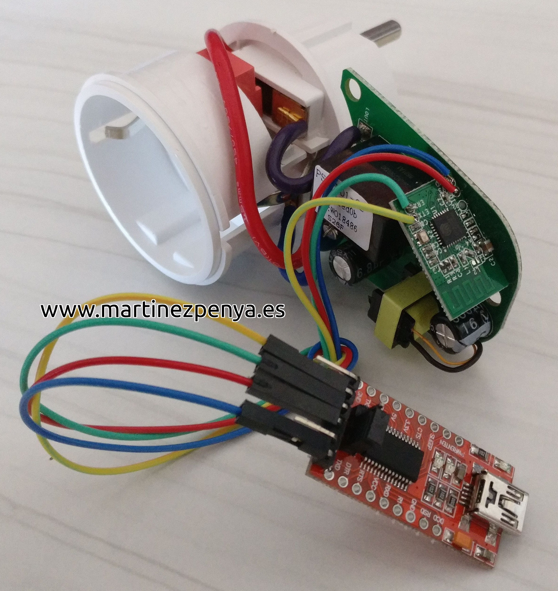
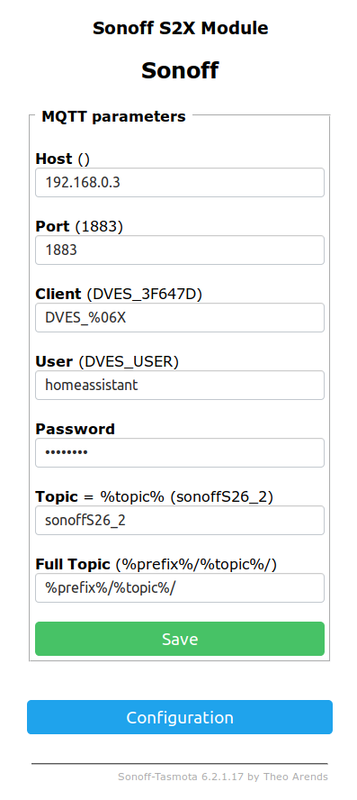

# Preparing [sonoff](http://https://www.sonoff.in/) with [tasmota](https://github.com/arendst/Sonoff-Tasmota) firmware for [HomeAssistant](https://home-assistant.io/)

## Preparation:
1. Install [Atom](https://atom.io/) environment.
1. Add [PlatformIO](https://platformio.org/platformio-ide):
    1. Open **Atom Package Manager**:
        - Windows, Menu: File > Settings > Install
        - Mac, Menu: Atom > Preferences > Install
        - Linux, Menu: Edit > Preferences > Install
    1. Search for official `platformio-ide` package
    1. Install PlatformIO IDE.
1. Install [esptool.py](https://github.com/espressif/esptool)

## Source code
1. Clone [tasmota](https://github.com/arendst/Sonoff-Tasmota) repository:

    - `git clone git@github.com:arendst/Sonoff-Tasmota.git`
1. Open Atom and `Open folder...` where you cloned Sonoff-Tasmota repository.
1. Search and open `sonoff` folder on `Project` (left panel)
1. Edit `user_config.h`:
    - `hostname`
    ```c++
    #define PROJECT        "sonoffs26_1" // PROJECT is used as the default topic delimiter
    ```
    - `dhcp or static ip`
    ```cpp
    #define WIFI_IP_ADDRESS        "0.0.0.0"         // [IpAddress1] Set to 0.0.0.0 for using DHCP or IP address
    #define WIFI_GATEWAY           "192.168.2.254"   // [IpAddress2] If not using DHCP set Gateway IP address
    #define WIFI_SUBNETMASK        "255.255.255.0"   // [IpAddress3] If not using DHCP set Network mask
    #define WIFI_DNS "192.168.2.27" // [IpAddress4] If not using DHCP set DNS IP address (might be equal to WIFI_GATEWAY)
    ```
    - `WIFI setup`
    ```cpp
#define STA_SSID1 "" // [Ssid1] Wifi SSID
    #define STA_PASS1 "" // [Password1] Wifi password
    ```
1. Selec build from PlatformIO menu (Alt+Ctrl+B)
1. On terminal open `.pioenvs/sonoff` folder in cloned git folder and search for `firmware.bin`

## Hardware setup
1. You will need a sonoff product (s26 in my case)
1. An FTDI (serial to usb converter)
1. Weld wires and connect to FTDI as in image:


## Firmware upload
1. Connect FTDI and sonoff to computer:
    - Press sonoff button
    - connect USB to your computer
    - wait 4-5 seconds
    - release button
1. In console launch:
```sh
esptool.py --port /dev/ttyUSB0 write_flash -fs 1MB -fm dout 0x0 .pioenvs/sonoff/firmware.bin
```

## Configure HomeAssistant
Add to `configure.yaml`:
```yaml
mqtt:
  password: !secret mqttpassword
```

## Configure Sonoff
1. Connect to the ip of your device with webbrowser
1. In `Configuration`/`Configure Module` select `08 Sonoff S2X` and Save
1. In `Configuration`/`Configure MQTT` configure Host, User and Password as seen:
