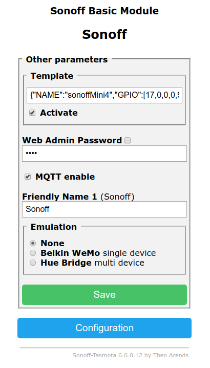

# Preparing [sonoffMini](http://https://www.sonoff.in/) with [tasmota](https://github.com/arendst/Sonoff-Tasmota) firmware for [HomeAssistant](https://home-assistant.io/)

## We will need:
1. App [eWLink](https://play.google.com/store/apps/details?id=com.coolkit&hl=en_US) (this APP only works with 2,4GHz Wi-Fi, so configure your AP properly).
1. A computer with Windows 10 and capable of being a WiFi AP.

## Update sonoffMini to latest firmware (3.3.0)
1. Connect wires to sonoffMini as in this image (without jumper):


1. Power on sonoffMini and after that press button for more than 5 seconds. Then led will blink continuously.
1. Open eWLink App in you phone
    1. Add device
    1. AP compatible pairing (down of all buttons, as a link)
    1. Disable Mobile Data connection
    1. Next
    1. Select WiFi AP to provide Internet, then Next
    1. Rename device (optional)
    1. Upgrade firmware to 3.3.0 version (three dots upside right)
    1. You can check to switch relay from app or from the phisycal switch.

## sonoffMini in OTA mode
1. Turn off sonoffMini
1. Put jumper (OTA mode)
1. Power on sonoffMini
1. Configure Wifi in AP mode in windows 10 with this settings:
  1. name: sonoffDiy
  1. password: 20170618sn
1. sonoffMini will try to connect to this AP

## Flash Tasmota via OTA
1. Download tool_01DIY85(3.3.0).exe from [here](https://github.com/itead/Sonoff_Devices_DIY_Tools)
1. Download sonoff-basic.bin with 2.3.0 core (below 500Kb) from [here](http://thehackbox.org/tasmota/020300/sonoff-basic.bin)
1. Start tool_01DIY85(3.3.0).exe and wait sonoffMini to appear
1. Rename device (Edit name) (optional)
1. Press [Firmware flash]
1. [Import firmware] and select sonoff-basic.bin
1. [Flash device list] it will show you a window with selected device
1. Press OK and wait until device is flashed
1. Close windows
1. Power off sonoffMini
1. Remove OTA jumper
1. Power on sonoffMini and after that press four times the button and sonoffMini will create an AP like "sonoff-XXXX"

## Configure Tasmota for HomeAssistant
1. Login into AP (without password)
2. It'll redirect you to a configuration page and you have to select your SSID, password and hostname:


1. Search sonoffMini IP address in any APP like [Fing](https://play.google.com/store/apps/details?id=com.overlook.android.fing&hl=en)

2. Login to this IP or to http://hosname.lan

3. Select [Console] button and launch this commands:

   ```
   template {"NAME":"Sonoff Mini","GPIO": [17,0,0,0,9,0,0,0,21,56,0,0,255],"FLAG":0,"BASE":1}
   SwitchRetain off
   ButtonRetain on
   ButtonRetain off
   PowerOnState 3
   PowerRetain on
   wificonfig 5
   ```

4. Select [Configure Other] from [Configuration] menú and make sure Activate check button is selected and [Save]



1. [Configuration Template] should look like this:


1. Configure MQTT

## Sources
1. https://domology.es/flashear-sonoff-mini-via-ota-firmware-tasmota-esphome/
1. https://github.com/arendst/Sonoff-Tasmota/wiki/Sonoff-DIY